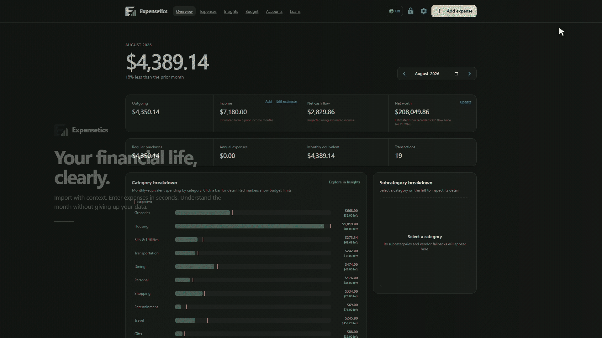

# Expensetics

[](https://github.com/Crouzbehmeshkin/Expensetics/actions/workflows/quality.yml)
[](https://www.python.org/downloads/)
[](LICENSE)

**Private, local-first personal finance tracking built around reviewed bank imports and deterministic, history-aware categorization.**

I built Expensetics to solve a recurring problem in my own finances: reviewing transactions should not require repetitive spreadsheet work, handing financial history to a cloud service, or re-entering the same merchant and category decisions every month. The application keeps that workflow local, private, and deliberately focused.

Import the transaction file already supplied by a supported bank or card provider, review deterministic suggestions learned from prior confirmed choices, and correct only what needs attention. Merchant, category, and subcategory decisions improve later imports without sending financial data to a remote model or service.

The result is one encrypted local record for expenses, settlements, income, accounts, budgets, net worth, and liabilities. Monthly views and deterministic insights show where money went, how spending changed, and how actual costs compare with prior months and budgets. Expensetics is intentionally a personal finance tracker rather than a general accounting suite or cloud bank-sync service.



## What it does

- **Reviewed bank imports.** Bank-specific CSV adapters extract transaction date, vendor, and amount, then present a scrollable review grid before anything is saved. Exact vendor history, bank-provided classifications, deterministic trigram similarity, and category usage improve suggestions over time. Duplicate transactions and non-purchase rows are identified before import.
- **Fast manual entry.** The keyboard-first expense editor supports description autocomplete, remembered categories, an inherited date for consecutive entries, optional accounts, settlements, and rapid save-and-next entry.
- **Custom organization.** Categories and subcategories can be added, ordered, archived, restored, and explicitly mapped across historical records. Accounts are optional labels that make entry and import easier without fragmenting the unified financial view.
- **Monthly overview and detailed insights.** Dashboards summarize outgoing cash, income, cash flow, category and subcategory spending, annual-cost equivalents, net worth, and month-over-month movement. Smooth stacked flows retain exact monthly values and show a separate limit line only when the user has explicitly set a total monthly budget. The Insights page adds transaction frequency, merchant activity, recurring-price and timing changes, robust amount outliers, weekday patterns, and settlement activity; sparse signals appear only when their documented history and materiality rules are satisfied.
- **Budgeting.** Category budgets persist until revised and can be applied historically or within a calendar year. Spending views compare actual monthly-equivalent costs with the budget position.
- **Income, net worth, and liabilities.** Recorded income can establish a deterministic recency-weighted estimate for months without an entry. Net-worth estimates extend actual snapshots using recorded cash flow. Loan and mortgage tools support explicit terms, Canadian interest conventions, observed imported payments, balances, payoff projections, and payment trends.
- **Private portability.** The database is encrypted locally, and complete password-protected `.expensetics` backups are created only when requested. Backups can move the vault to another computer without producing a readable CSV mirror.

History-aware behavior is deterministic and inspectable; it does not depend on a remote model or external classification service. Financial calculations use integer cents and documented rules.

## Installation

Source installation is supported today on Windows, macOS, and Linux. Signed desktop installers are planned but are not yet published. Install [Python 3.11 or newer](https://www.python.org/downloads/), then clone the repository or download and extract GitHub's source archive:

```sh
git clone https://github.com/Crouzbehmeshkin/Expensetics.git
cd Expensetics
```

Expensetics runs a loopback-only service and opens its interface in the normal system browser. It requires no cloud account or continuously available internet connection, and setup installs packages only inside the project's `.venv`.

### Windows

Double-click **Run Expensetics.cmd** from the extracted project folder. It creates `.venv` on first launch, verifies and installs the locked runtime dependencies, and starts the app. The equivalent PowerShell commands are:

```powershell
.\scripts\setup.ps1
.\.venv\Scripts\python.exe app.py
```

The future Windows release target is a conventional per-user installer with a one-folder portable ZIP as a secondary option. Packaged builds will store the encrypted vault under `%LOCALAPPDATA%\Expensetics`; source checkouts store it in the ignored `data` directory.

### macOS

From the cloned or extracted project directory, run:

```sh
sh scripts/setup.sh
./.venv/bin/python app.py
```

The future macOS release target is a signed and notarized DMG. Packaged builds will store the encrypted vault under `~/Library/Application Support/Expensetics`; source checkouts store it in the ignored `data` directory.

### Linux

Install the distribution's Python `venv` module when it is packaged separately, then run from the project directory:

```sh
sh scripts/setup.sh
./.venv/bin/python app.py
```

Future packaged builds will store the encrypted vault under `$XDG_DATA_HOME/Expensetics` or `~/.local/share/Expensetics`. Source checkouts use the repository's ignored `data` directory unless `EXPENSETICS_DATA_DIR` is set.

On every platform, open `http://localhost:8080` if the browser does not open automatically. Keep the `localhost` hostname rather than substituting `127.0.0.1`; device unlock relies on the browser's secure-context exception for `localhost`.

Setup installs the complete runtime graph from `requirements/runtime.lock` with SHA-256 verification. Runtime, development, packaging, and dependency-maintenance profiles are organized under `requirements/`, with separate hash-locked environments so tooling is not shipped with the application.

## Working with transactions

Press `N` anywhere outside an input to open the expense editor. Enter the amount, press Tab, type a description, press Tab to accept the best historical match, and press Enter to save. Categories are suggested from prior matching transactions and can always be overridden with one click.

Categories and their optional subcategories are fully customizable under **Settings → Manage categories**. Adding, ordering, archiving, or restoring a definition affects future entry choices only. When a used category is replaced, its historical records remain under the archived definition unless you explicitly use **Migrate history**. The migration tool previews the affected transaction count, net amount, date range, and learned import choices before confirmation, and keeps an audit log. Its help button explains the scope; budgets and category definitions are intentionally not rewritten by a transaction migration.

On the Overview page, press Left Arrow or Right Arrow to move one month backward or forward. These shortcuts are disabled while typing or while a dialog is open.

Use the compact **Settlement** option for reimbursements that should reduce an expense category rather than count as income. Enter the positive settlement amount, then choose its category and optional subcategory. It is stored and exported as a signed negative transaction, so category totals, outgoing cash, cash flow, and monthly trends reconcile naturally. **Annual allocation** can spread either an expense or a settlement across twelve monthly-equivalent periods.

## Encrypted local data

SQLCipher-encrypted SQLite is the sole persistent source of truth at `data/finance.db`. On first launch after upgrading, choose an app password of at least 12 characters. An existing plaintext database is copied into an encrypted database and integrity-checked before that exact plaintext source and the app's specifically named legacy CSV mirrors are removed.

The app password directly unlocks the database and is held in process memory while the vault is open. By default it is not persisted. Optional **Settings → Device unlock** uses the browser's WebAuthn platform authenticator and PRF extension to wrap that password with a key released by Windows Hello, Touch ID, or the device password/PIN. Only an authenticated AES-GCM envelope is saved in `data/device-unlock.json`; the readable password and PRF key are not stored. Manual password unlock always remains available.

Device unlock is deliberately local convenience, not portable recovery. Its encrypted envelope also records the authenticator's non-secret transport hint so Windows can return assertion requests to the same passkey provider. It is not included in `.expensetics` backups, and losing the platform credential still requires the app password or a separate encrypted backup. Use the header lock button when stepping away.

On Windows 11, the system prompt may offer a synced passkey manager before the device-bound Windows Hello provider. For device-local unlock, choose **Save another way**, then **Windows Hello** or **This Windows device**; the normal Windows sign-in PIN or biometric is the expected verification. Expensetics cannot select a particular Windows passkey provider through the standard WebAuthn API.

Each unlocked browser session also receives a server-side access capability with a 10-minute inactivity expiry. Real keyboard, pointer, touch, and scroll activity refreshes it; database and backup operations validate it at their shared access boundary. Expiry or Lock invalidates access before clearing the in-memory database key, so stale tabs and callbacks fail closed.

Existing databases are migrated automatically and atomically when the application starts. Schema version 17 adds encrypted bank-import history while preserving the reusable subcategory definitions and auditable historical category mappings introduced earlier. Accounts are organizational labels only: balances are not required and all reporting remains unified.

Financial calculations use integer cents and documented deterministic rules. See [`docs/CALCULATIONS.md`](docs/CALCULATIONS.md) for the exact allocation, forecasting, budgeting, and amortization formulas.

To move records to another computer, open **Settings → Encrypted backup** and create an `.expensetics` file with a separate backup password. Backup creation is atomic and will not overwrite an existing file. On the new computer, create or unlock its local vault, then use **Restore encrypted backup**. Restore verifies and decrypts the backup before atomically replacing the local database; the backup is re-encrypted under the destination app password. Before v1, restore intentionally accepts only the current schema version; compatibility migration for older backup builds is deferred until the v1 format is stable.

**Delete all local data** removes the database, device-unlock envelope, and known local sidecar/legacy files, then verifies that their directory entries are gone. On SSDs, wear-leveling means software cannot honestly guarantee that every old physical flash block was overwritten; encryption and destruction of the only usable database/key are therefore the durable protection.

## Bank CSV import

On the Expenses page, choose **Import CSV**, select the bank that produced the export, then choose its original CSV. North American support covers American Express (US), Apple Card, BMO, Bank of America, Capital One, Chase, CIBC, Citi, Desjardins, Discover, RBC, Rogers, Scotiabank, TD, U.S. Bank, and Wells Fargo. European support covers Monzo, N26, Rabobank, Revolut Business, Starling, Wise, and bunq. Asian support currently covers MUFG BizSTATION, Mizuho Business WEB, and SMBC Direct. Rabobank account and credit-card files and both Revolut Business export variants are identified by strict headers behind one provider choice. Expensetics dispatches the file to that bank's strict parser rather than guessing the format, and opens a scrollable review grid before saving anything. Transaction date, vendor, and amount come from the bank; description, category, subcategory, and annual-expense treatment remain editable. Annual expenses are allocated from their transaction month across exactly 12 months without another duration field.

Accepted uploads stay in memory and are not copied into the data directory or an operating-system temp file. The 16 MiB and 20,000-row limits are defensive resource ceilings, not bank-format requirements; normal personal statements are far smaller.

After a successful reviewed import, the encrypted database retains only the source filename, bank, optional account, transaction date range, and row counts. The original CSV bytes are discarded.

Purchases are selected by default. Credits, payments, exact repeat imports, and likely duplicates with the same transaction date, vendor, and amount are flagged and excluded. A likely duplicate can still be included deliberately; exact repeat imports cannot. Confirmed vendor choices are learned locally so future files start with better description, category, and subcategory suggestions—even when the same canonical vendor later appears through another bank. Subcategories remain category-dependent: exact history and bank-identified values take priority, followed by a deterministic similar-vendor match and the selected category's most-used value. User-entered subcategories become reusable only within their category. Posting dates and card numbers are not stored.

Synthetic, sanitized format fixtures live in `tests/fixtures/bank_csv`. They contain no personal financial data and make bank-format changes explicit and regression-testable. The evidence, exact column/date contracts, and researched unsupported-bank backlog are documented in [`docs/BANK_IMPORT_COMPATIBILITY.md`](docs/BANK_IMPORT_COMPATIBILITY.md).

## Languages

The persistent header language control supports English, French, and Spanish on every page. Localization affects presentation only; transaction data, category keys, database values, and encrypted backup schemas remain stable.

## Contributing

The most valuable contributions extend reviewed CSV import support to another bank, credit union, or card issuer. Expensetics accepts an adapter only when its format and transaction semantics are supported by evidence and protected by a synthetic regression fixture. Never commit or attach an original statement, account number, transaction history, or other personal financial data.

A complete bank-adapter contribution normally includes:

1. the institution, country, account/card product, export steps, encoding, delimiter, exact minimum columns, date format, and debit/credit sign convention;
2. an official specification, provider help page, or clearly documented sanitized export as evidence;
3. a strict deterministic parser registered in `BANK_PARSERS` and the appropriate regional group;
4. a synthetic fixture that preserves the structural contract without preserving real values;
5. tests for purchases, credits/payments, malformed headers, date strictness, and the supported-bank registry; and
6. an update to [`docs/BANK_IMPORT_COMPATIBILITY.md`](docs/BANK_IMPORT_COMPATIBILITY.md).

Adapters should require only the columns they actually consume, tolerate unrelated extra columns, reject ambiguous formats, and send every parsed row through the existing review workflow. See [CONTRIBUTING.md](CONTRIBUTING.md) for the complete workflow and verification commands. If you are requesting support rather than writing the adapter, open an issue with the product and format details—but do not upload the original CSV.

## Documentation

- [Bank import contracts and unsupported-provider backlog](docs/BANK_IMPORT_COMPATIBILITY.md)
- [Deterministic financial calculations](docs/CALCULATIONS.md)
- [Import and encrypted-backup guidance](docs/IMPORT_FORMAT.md)
- [Dependency review and update process](docs/DEPENDENCIES.md)
- [Windows, macOS, and Linux packaging](docs/PACKAGING.md)
- [Security design and vulnerability reporting](SECURITY.md)

## Tests

```powershell
.\.venv\Scripts\python.exe -m pip install --require-hashes -r requirements/dev.lock
.\.venv\Scripts\python.exe -m playwright install chromium
.\.venv\Scripts\python.exe -m pytest -m "not e2e" --cov=finance_app
.\.venv\Scripts\python.exe -m pytest -m e2e
```

Business and persistence code has an enforced 80% branch-aware coverage floor. Hypothesis property tests generate cent allocations, signed money round trips, month shifts, payment streams, income histories, and reviewed import batches to verify invariants across edge cases that example-based tests may miss. UI behavior is verified separately in a real Chromium process, including vault creation, rapid entry/autocomplete, expenses, bank-import upload flow, and every main page.

## Dependency maintenance

Direct package choices stay in four short `.in` files under `requirements/`; reproducible runtime, test, packaging, and maintenance graphs are generated separately with artifact hashes. [`docs/DEPENDENCIES.md`](docs/DEPENDENCIES.md) is the source of truth for researching changes, vulnerability response, diff review, automated tests, and functional smoke testing.

The optional helper handles only lock generation and advisory scanning:

```powershell
.\scripts\update_dependencies.ps1
```

Use `sh scripts/update_dependencies.sh` on macOS or Linux. The command uses its own `.dependency-venv`, leaves the app environment untouched, and restores the previous locks if any graph fails to compile or audit. It does not replace the documented review and verification process.

## Desktop packages

The Windows release target is an installer wrapped around a one-folder PyInstaller payload, with a ZIP of that folder as the secondary portable option. The macOS release target is a signed and notarized application in a DMG. Linux currently supports isolated source installation, with a portable distribution deferred until its target distributions and architectures are defined. See [`docs/PACKAGING.md`](docs/PACKAGING.md); packages are built on their target operating system and build tooling remains in `.build-venv`, never in the global Python environment.

## License

Expensetics is available under the [MIT License](LICENSE).
